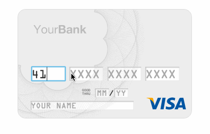

# react-skeuocard

## Description

Create a React Component that handles credit card input and provides visual feedback of the card type (see below).

Visual Inspiration:


## Objectives

### Learning Objectives

After completing this assignment, you should…

* Understand how to handle a wide range of inputs and input events in React
* Understand 3d transforms, CSS animations, and form skinning
* Understand Regular Expressions

### Performance Objectives

After completing this assignment, you be able to effectively use

* React Components
* React Virtual DOM Events
* A fair amount of HTML/CSS control and animations
* Using regex in form fields (validating either through JS or through the input tag's `pattern` attribute)

## Details

### Deliverables

* A publicly visible website (gh-pages or surge)

## Normal Mode

- The React Component should render a basic credit card layout, like the visual example above.
- If the date is in the past, the card should highight in red.
- If some, but not all, of the fields are filled out, the card should highlught in red.

When you begin entering your card number, the Component should attempt to match it to an accepted card type (see below: Accepted Credit Card Numbers). 

Once it is able to do so, it modifies the layout of the card to match the card product (Visa, MasterCard, etc) and makes any tweaks specific to the issuer -- for example, the special layout of the Chase Sapphire card.

As you enter your information, the Component should modify the underlying form values from your original, non-enhanced form. It also validates each field to find simple user mistakes and missing fields.

### Accepted Credit Card Numbers

The Component should use RegEx to determine, after three characters, which type of card a user is entering. You are also welcome to use a library to do this work for you. Ex: [https://github.com/braintree/card-validator](https://github.com/braintree/card-validator)

The following is an example list of acceptable credit card numbers:

```
Visa: 4111111111111111
Discover: 6011111111111117
MasterCard: 5111111111111118
Maestro: 5018111111111112
JCB: 3511111111111119
Union Pay: 6211111111111111
American Express: 371111111111114
Diners Club: 38111111111119
```

## Hard Mode

In addition to Normal Mode:

If the card product has fields on both sides of the card (for example, placing the CVC code on the back) the user will be prompted to flip the card to fill in the remaining fields.



## More inspiration
[https://jessepollak.github.io/card/](https://jessepollak.github.io/card/)